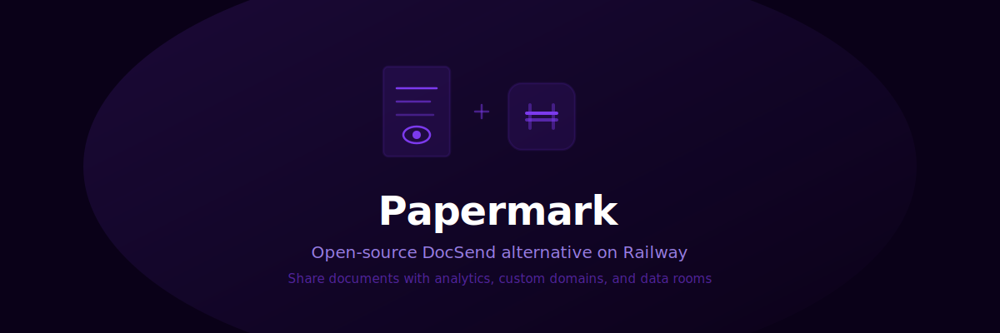

<p align="center">
  
</p>

<p align="center">
  <strong>Open-source DocSend alternative with page analytics, custom domains, and data rooms. One-click deploy to Railway.</strong>
</p>

<p align="center">
  <a href="https://railway.com/deploy/papermark">
    
  </a>
</p>

<p align="center">
  <a href="https://github.com/atoolz/railway-papermark/blob/main/LICENSE">
    
  </a>
  
  
  
  
</p>

<br>

## Deploy and Host Papermark on Railway

Papermark is an open-source document sharing platform and DocSend alternative. Share pitch decks, proposals, contracts, and any document with a trackable link. See who viewed each page, how long they spent, and whether they downloaded it. Add email capture, password protection, custom branding, and your own domain. Built with Next.js, Prisma, and PostgreSQL.

### About Hosting Papermark

The template clones the upstream [mfts/papermark](https://github.com/mfts/papermark) repository and builds it inside a multi-stage Dockerfile (Node 22 slim). Prisma generates the client at build time; migrations run automatically at container startup via `prisma migrate deploy`. The app listens on **`PORT`** (default 3000) and reads **`POSTGRES_PRISMA_URL`** for the database. You need blob storage for uploaded documents: either a **Vercel Blob** token or **S3-compatible** credentials (AWS, MinIO, Cloudflare R2). Email notifications require a **Resend** API key. Google OAuth is optional but recommended for login.

### Common Use Cases

- Sharing pitch decks with investors and tracking who opened each slide and for how long
- Sending proposals and contracts with email verification, NDA acceptance, and download controls
- Running virtual data rooms for due diligence with granular viewer permissions and audit trails

### Dependencies for Papermark Hosting

- Railway **PostgreSQL** (or any Postgres-compatible URL)
- **Blob storage** for documents: Vercel Blob token or S3/R2/MinIO credentials
- **Resend** API key for transactional emails (optional but recommended)
- **Google OAuth** credentials for login (optional; email/magic link works without it)

#### Deployment Dependencies

- [Papermark](https://github.com/mfts/papermark)
- [Next.js](https://nextjs.org/)
- [Prisma](https://www.prisma.io/)
- [Resend](https://resend.com/)
- [Railway](https://railway.com/)

### Why Deploy on Railway?

Railway hosts your stack with minimal configuration and scales as you grow.

<br>

## What's Inside

| Layer | Technology | Role |
|-------|-----------|------|
| **Frontend** | Next.js 14 + Tailwind + Radix UI | Dashboard, viewer, link pages |
| **Auth** | NextAuth.js | Google OAuth, email, passkeys |
| **Database** | PostgreSQL + Prisma | Users, documents, views, analytics |
| **Storage** | Vercel Blob or S3-compatible | Uploaded PDFs, images, videos |
| **Email** | Resend | Notifications, viewer invitations |

<br>

## Deploy to Railway

1. Click the **Deploy on Railway** button above
2. Railway provisions **PostgreSQL** automatically
3. Set the required environment variables (see below)
4. The Dockerfile clones Papermark, builds it, and runs migrations on start
5. Open your Railway public domain and create your account

<br>

## Environment Variables

### Required (web service)

```bash
POSTGRES_PRISMA_URL="${{Postgres.DATABASE_URL}}" # Prisma connection pooling URL
POSTGRES_PRISMA_URL_NON_POOLING="${{Postgres.DATABASE_URL}}" # direct URL for migrations
NEXTAUTH_SECRET="${{ secret(32, \"abcdefghijklmnopqrstuvwxyzABCDEFGHIJKLMNOPQRSTUVWXYZ0123456789\") }}" # session encryption key
NEXTAUTH_URL="https://your-app.up.railway.app" # your Railway public URL (update after first deploy)
NEXT_PUBLIC_BASE_URL="https://your-app.up.railway.app" # same as NEXTAUTH_URL
```

### Storage (pick one)

**Option A: Vercel Blob** (easiest, free tier available)

```bash
NEXT_PUBLIC_UPLOAD_TRANSPORT="vercel"
BLOB_READ_WRITE_TOKEN="" # from vercel.com/dashboard/stores
```

**Option B: S3-compatible** (AWS, R2, MinIO)

```bash
NEXT_PUBLIC_UPLOAD_TRANSPORT="s3"
NEXT_PRIVATE_UPLOAD_BUCKET="your-bucket"
NEXT_PRIVATE_UPLOAD_REGION="us-east-1"
NEXT_PRIVATE_UPLOAD_ACCESS_KEY_ID=""
NEXT_PRIVATE_UPLOAD_SECRET_ACCESS_KEY=""
NEXT_PRIVATE_UPLOAD_DISTRIBUTION_HOST="your-bucket.s3.us-east-1.amazonaws.com"
```

### Optional

```bash
RESEND_API_KEY="" # transactional emails (viewer notifications, invitations)
GOOGLE_CLIENT_ID="" # Google OAuth login
GOOGLE_CLIENT_SECRET="" # Google OAuth login
NEXT_PRIVATE_DOCUMENT_PASSWORD_KEY="" # encryption key for document passwords
```

<br>

## Railway template: PostgreSQL service variables

```bash
PGDATA="" # data directory (volume); often set by the image
PGHOST="${{RAILWAY_PRIVATE_DOMAIN}}" # private hostname for other Railway services
PGPORT="" # omit for default 5432, or set explicitly
PGUSER="${{POSTGRES_USER}}" # DB role; keep aligned with POSTGRES_USER
PGDATABASE="${{POSTGRES_DB}}" # database name
PGPASSWORD="${{POSTGRES_PASSWORD}}" # password for PGUSER
POSTGRES_DB="papermark" # DB created on first init
DATABASE_URL="postgresql://${{PGUSER}}:${{POSTGRES_PASSWORD}}@${{RAILWAY_PRIVATE_DOMAIN}}:5432/${{PGDATABASE}}" # in-cluster connection string
POSTGRES_USER="papermark" # superuser name on first init
POSTGRES_PASSWORD="${{ secret(32, \"abcdefghijklmnopqrstuvwxyzABCDEFGHIJKLMNOPQRSTUVWXYZ\") }}" # generated root password
DATABASE_PUBLIC_URL="postgresql://${{PGUSER}}:${{POSTGRES_PASSWORD}}@${{RAILWAY_TCP_PROXY_DOMAIN}}:${{RAILWAY_TCP_PROXY_PORT}}/${{PGDATABASE}}" # TCP proxy for external clients
```

**Template icon (Railway):** [assets/icon.png](https://raw.githubusercontent.com/atoolz/railway-papermark/main/assets/icon.png) · [assets/icon.svg](https://raw.githubusercontent.com/atoolz/railway-papermark/main/assets/icon.svg)

<br>

## Local Development

```bash
git clone https://github.com/mfts/papermark.git
cd papermark
cp .env.example .env
# Edit .env with your Postgres URL, storage, and auth config
npm install
npx prisma generate
npx prisma migrate deploy
npm run dev
```

Open [http://localhost:3000](http://localhost:3000).

<br>

## License

[MIT](LICENSE)

---

<p align="center">
  <sub>Built by <a href="https://github.com/atoolz">AToolZ</a></sub>
</p>
